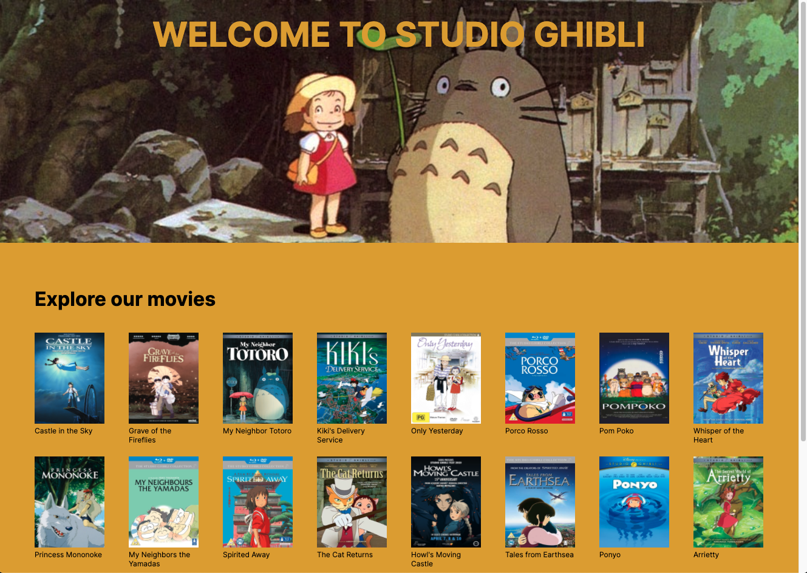
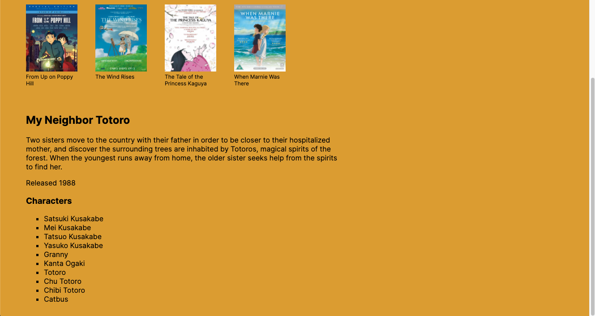

# studio_ghibli

## Project setup
```
npm install
```

```
npm run serve
```


## Brief

- Create an application that makes a request to an API and displays the data.
- Application should be a multi-component web application created with Vue.

### API

Studio Ghibli: https://ghibliapi.herokuapp.com/

### MVP

- The application should display data from an API request.
- The application should have a clear separation of concerns (multiple components).
- Take input from the user to update the page. You could update the page by filtering or manipulating the data on user interaction, or you might make further API requests to load more data that is then displayed.



